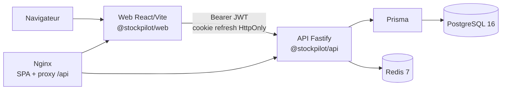

# StockPilot

**StockPilot** est une application web de pilotage des stocks, des approvisionnements et des ventes pour une petite entreprise. Le dépôt est un monorepo TypeScript : une API Fastify organisée par domaines métier, une interface React/Vite et une base PostgreSQL pilotée par Prisma.

StockPilot permet de suivre les produits, les seuils d'alerte, les mouvements, les commandes fournisseurs, les ventes, la marge et les utilisateurs d'une organisation. Les données sont isolées par organisation et les opérations de stock sont conservées dans un journal traçable.

> **État de la documentation :** les captures ci-dessous sont des emplacements explicites, pas des captures d'un environnement exécuté. Les commandes de vérification décrivent la procédure attendue ; ce README ne constitue pas un journal de tests exécutés.

## Fonctionnalités

- **Authentification et rôles** : inscription initiale, connexion, renouvellement de session, rôles `ADMIN`, `MANAGER`, `EMPLOYEE` et `VIEWER`.
- **Tableau de bord** : chiffre d'affaires, achats, valeur du stock, marge brute, séries temporelles, top produits et alertes.
- **Catalogue** : produits, SKU, codes-barres, unités, catégories hiérarchiques, prix, taxes et seuils.
- **Stock** : mouvements immuables, entrées/sorties, ajustements motivés et calcul du stock courant.
- **Achats** : fournisseurs, brouillons, transmission, réception partielle/totale et mise à jour transactionnelle du stock.
- **Ventes** : clients, lignes de vente, sortie de stock, taxes, coût de revient et marge.
- **Administration** : organisation, utilisateurs, rôles et activation/désactivation.
- **Exports CSV** : produits, ventes et mouvements de stock.
- **API REST versionnée** : contrat documenté dans [`docs/API.md`](docs/API.md).

## Captures d'écran

> **Placeholder — captures non fournies.** Les images réelles devront être ajoutées dans `docs/images/` lors d'une livraison avec l'interface finalisée. Ne pas interpréter les encadrés suivants comme des fonctionnalités ou des résultats mesurés.

- **Connexion** — _capture placeholder : écran de connexion et message de sécurité_.
- **Tableau de bord** — _capture placeholder : KPI, courbe de chiffre d'affaires et alertes_.
- **Catalogue** — _capture placeholder : liste produits, filtre catégorie et seuil_.
- **Commande d'achat** — _capture placeholder : réception partielle et impact sur le stock_.

## Stack

| Couche | Choix |
| --- | --- |
| Monorepo | npm workspaces (`apps/*`) |
| Langage | TypeScript |
| API | `@stockpilot/api`, Fastify, Zod, OpenAPI/Swagger |
| Web | `@stockpilot/web`, React, Vite, TypeScript, React Query, Axios, Recharts |
| Persistance | PostgreSQL 16 + Prisma ORM |
| Cache/session | Redis 7 |
| Runtime local | Node.js 22 LTS, npm 10+ |
| Infrastructure | Docker Compose, images multi-stage et Nginx |
| Qualité | ESLint, TypeScript, Vitest et GitHub Actions |

## Architecture



En développement, Vite sert le front sur `http://localhost:5173` et l'API écoute sur `http://localhost:3000`. En Docker, Nginx sert le bundle web sur `http://localhost:8080` et proxifie `/api/` vers l'API. Les détails des frontières, des invariants et du modèle de données sont dans [`docs/ARCHITECTURE.md`](docs/ARCHITECTURE.md).

## Prérequis

### Obligatoire

- **Git** 2.40 ou plus récent.
- **Node.js 22 LTS** (la CI utilise Node 22).
- **npm 10 ou plus récent**, fourni avec Node.js.
- **Docker Desktop** ou Docker Engine avec Compose v2 pour l'option Docker.
- Un terminal compatible avec les commandes POSIX, ou une adaptation des commandes `.env` pour PowerShell.

### Pour le développement sans Docker

- PostgreSQL 16 accessible localement.
- Redis 7 accessible localement.

Les versions exactes des services sont épinglées dans [`docker-compose.yml`](docker-compose.yml). Les données par défaut (`stockpilot` / `stockpilot`) sont uniquement destinées au développement local.

## Démarrage local

### 1. Installer les dépendances

```bash
git clone <url-du-depot>
cd StockPilot
cp .env.example .env
npm install
```

Le projet utilise npm workspaces et versionne un unique `package-lock.json` à la racine. Utilisez `npm ci` pour une installation reproductible, ou `npm install` après une modification volontaire des dépendances.

### 2. Configurer l'API et le web

L'API charge ses variables depuis son workspace. Copiez l'exemple racine vers le fichier local correspondant, puis adaptez les valeurs :

```bash
cp .env.example apps/api/.env
printf 'VITE_API_URL=http://localhost:3000/api/v1\n' > apps/web/.env.local
```

Ces fichiers sont ignorés par Git. Ne copiez pas de secrets de production dans `apps/web` : Vite ne doit exposer que les variables `VITE_*`.

### 3. Démarrer PostgreSQL et Redis

Le plus simple est de ne lancer que l'infrastructure avec Docker :

```bash
docker compose up -d postgres redis
```

Ou utilisez une installation PostgreSQL 16/Redis 7 locale et vérifiez que les URL de `.env` sont correctes.

### 4. Générer le client et préparer la base

```bash
npm run db:generate
npm run db:migrate
npm run db:seed       # optionnel, données de démonstration
```

`db:migrate` est interactif et réservé au développement. Pour un environnement partagé ou une CI, utilisez `npm run db:deploy`.

### 5. Lancer les applications

```bash
npm run dev
```

- Web : <http://localhost:5173>
- API : <http://localhost:3000>
- Documentation OpenAPI : <http://localhost:3000/docs>
- Spécification JSON : <http://localhost:3000/openapi.json>

Les scripts `dev:api` et `dev:web` permettent de lancer un seul workspace. `npm run dev` arrête les deux processus si l'un d'eux échoue.

## Démarrage avec Docker

Docker Compose fournit PostgreSQL, Redis, l'API et le web. Les images API et web sont construites depuis le contexte racine afin de partager les workspaces npm.

```bash
cp .env.example .env
# Remplacez impérativement les deux secrets JWT dans .env.
docker compose up --build -d
docker compose ps
```

URLs locales :

- Web : <http://localhost:8080>
- API : <http://localhost:3000/api/v1>
- Health API : <http://localhost:3000/health>
- Documentation : <http://localhost:3000/docs>

Au premier démarrage, l'API applique les migrations (`RUN_MIGRATIONS=true` par défaut). Le seed n'est pas exécuté automatiquement afin de ne pas réécrire des données à chaque redémarrage :

```bash
docker compose exec api npm run db:seed
```

Commandes utiles :

```bash
docker compose logs -f api
docker compose exec api npm run db:status
docker compose down                 # conserve les volumes
docker compose down -v              # supprime PostgreSQL et Redis (destructif)
docker compose build --no-cache api web
```

Les ports hôte sont liés à `127.0.0.1` par défaut. Pour exposer un service sur une interface réseau, prenez une décision de sécurité explicite et utilisez un pare-feu ; ne publiez pas PostgreSQL ou Redis en production.

## Variables d'environnement

| Variable | Requis en production | Défaut développement | Description |
| --- | --- | --- | --- |
| `NODE_ENV` | oui | `development` | Mode de l'API. |
| `HOST` | oui | `0.0.0.0` | Interface d'écoute Fastify. |
| `PORT` | oui | `3000` | Port de l'API. |
| `DATABASE_URL` | oui | PostgreSQL local | URL Prisma vers PostgreSQL. |
| `DIRECT_URL` | non | même URL | URL directe réservée aux évolutions Prisma. |
| `REDIS_URL` | oui | `redis://localhost:6379` | Cache et sessions de refresh. |
| `JWT_ACCESS_SECRET` | oui | secret de développement | Secret HS256 de l'access token, 32 caractères minimum. |
| `JWT_REFRESH_SECRET` | oui | secret de développement | Secret distinct du refresh token, 32 caractères minimum. |
| `JWT_ACCESS_TTL` | oui | `15m` | Durée de l'access token. |
| `REFRESH_TTL_SECONDS` | oui | `604800` | Durée du refresh token et du cookie. |
| `COOKIE_SECURE` | oui | `false` | À passer à `true` avec HTTPS en production. |
| `CORS_ORIGIN` | oui | `http://localhost:5173,http://localhost:8080` | Origines autorisées, séparées par des virgules. |
| `RATE_LIMIT_MAX` | oui | `120` | Nombre de requêtes par fenêtre. |
| `RATE_LIMIT_WINDOW` | oui | `1 minute` | Fenêtre de limitation de débit. |
| `VITE_API_URL` | non | `http://localhost:3000/api/v1` | URL utilisée par Vite en local. |
| `DOCKER_VITE_API_URL` | non | `/api/v1` | URL injectée dans le bundle web Docker. |
| `RUN_MIGRATIONS` | oui | `true` | Applique `migrate deploy` au démarrage du conteneur API. |
| `POSTGRES_DB`, `POSTGRES_USER`, `POSTGRES_PASSWORD` | oui | `stockpilot` | Identifiants du service PostgreSQL Compose. |
| `POSTGRES_PORT`, `REDIS_PORT` | non | `5432`, `6379` | Ports publiés sur l'hôte. |
| `API_PORT`, `WEB_PORT` | non | `3000`, `8080` | Ports Docker publiés. |
| `LOG_LEVEL` | oui | `info` | Niveau de log Fastify. |

Les secrets de l'exemple ne sont pas des secrets de production. Générez des valeurs aléatoires distinctes, par exemple avec un gestionnaire de secrets, et ne les placez jamais dans `README.md`, les logs ou une image Docker.

## Base de données : migrations et seed

Le schéma de référence est `apps/api/prisma/schema.prisma`. Les migrations Prisma sont la seule façon prévue de modifier le schéma partagé.

| Commande | Usage |
| --- | --- |
| `npm run db:generate` | Régénère le client Prisma. |
| `npm run db:migrate` | Crée/applique une migration en développement ; peut poser des questions. |
| `npm run db:deploy` | Applique les migrations existantes sans interaction, pour CI/Docker/production. |
| `npm run db:seed` | Charge le jeu de données de démonstration. |
| `npm run db:status` | Affiche l'état des migrations. |
| `npm run db:studio` | Ouvre Prisma Studio. |
| `npm run db:reset` | **Destructif** : réinitialise la base locale et applique les migrations ; lancer ensuite `db:seed` si nécessaire. |

### Comptes de démonstration

Le seed `apps/api/prisma/seed.ts` crée une organisation `StockPilot Démo` et les comptes suivants. Ils sont exclusivement destinés au développement local :

| Rôle | Email | Mot de passe |
| --- | --- | --- |
| Administrateur | `admin@stockpilot.local` | `Admin123!` |
| Manager | `manager@stockpilot.local` | `Admin123!` |
| Employé | `employe@stockpilot.local` | `Admin123!` |
| Lecture seule | `viewer@stockpilot.local` | `Admin123!` |

Le seed ajoute également des catégories, produits, mouvements initiaux, un fournisseur, un client et des opérations de démonstration. Ne réutilisez jamais ces identifiants sur un environnement partagé ou exposé.

## Scripts racine

| Script | Effet |
| --- | --- |
| `npm run dev` | Lance API et web en parallèle. |
| `npm run dev:api` / `dev:web` | Lance un workspace. |
| `npm run build` | Build les workspaces qui définissent `build`. |
| `npm run typecheck` | Vérifie les types des workspaces. |
| `npm test` | Exécute les tests des workspaces. |
| `npm run test:watch` | Lance les tests en mode watch. |
| `npm run lint` | Lance ESLint dans les workspaces. |
| `npm run db:*` | Voir la section base de données. |

Les commandes `build:api`, `build:web`, `typecheck:*`, `test:*` et `lint:*` sont disponibles pour cibler une application. Les résultats dépendent des dépendances, de la base et de l'état du workspace ; aucune réussite de test n'est présumée par ce document.

## Exemples d'API

Les exemples supposent une API locale et un access token. La référence complète, les filtres et les codes d'erreur sont dans [`docs/API.md`](docs/API.md).

### Health check

```bash
curl http://localhost:3000/health
```

### Connexion

```bash
curl -c cookies.txt http://localhost:3000/api/v1/auth/login \
  -H 'Content-Type: application/json' \
  -d '{"email":"admin@stockpilot.local","password":"Admin123!"}'
```

### Produits et alertes

```bash
curl 'http://localhost:3000/api/v1/products?page=1&pageSize=20&lowStock=true' \
  -H "Authorization: Bearer $ACCESS_TOKEN"

curl http://localhost:3000/api/v1/products/alerts \
  -H "Authorization: Bearer $ACCESS_TOKEN"
```

### Ajustement de stock

```bash
curl -X POST http://localhost:3000/api/v1/adjustments \
  -H "Authorization: Bearer $ACCESS_TOKEN" \
  -H 'Content-Type: application/json' \
  -d '{"productId":"<uuid>","quantity":-1,"reason":"COUNT_CORRECTION","note":"Inventaire"}'
```

### Export CSV

```bash
curl -L 'http://localhost:3000/api/v1/exports?type=products' \
  -H "Authorization: Bearer $ACCESS_TOKEN" \
  -o products.csv
```

## Sécurité et confidentialité

- Mots de passe hachés avec bcrypt et jamais stockés en clair.
- Access JWT court, refresh token rotatif et cookie `HttpOnly`/`SameSite=Lax` pour le navigateur.
- Limitation de débit globale et limites plus strictes sur la connexion, l'inscription et le rafraîchissement.
- CORS par liste d'origines autorisées, en-têtes Helmet, validation Zod et enveloppes d'erreur sans stack trace.
- Isolation par `organizationId` vérifiée dans les services, pas seulement dans l'interface.
- `.env`, cookies, tokens et dumps de base ne doivent jamais être versionnés.
- En production : HTTPS, `COOKIE_SECURE=true`, secrets externalisés, sauvegardes chiffrées, rotation des accès et journal d'audit.
- Les exports et la documentation ne remplacent pas une analyse de sécurité ; une revue de sécurité est nécessaire avant des données réelles.

## Workflow contributeur

1. Fork ou branche de travail : `feat/...`, `fix/...` ou `docs/...`.
2. Copier `.env.example`, installer avec `npm install` et générer le client Prisma.
3. Préparer une base locale avec `npm run db:deploy` et, si nécessaire, `npm run db:seed`.
4. Modifier le workspace concerné et ajouter des tests pour les règles métier ou les régressions.
5. Vérifier avant ouverture de PR :

   ```bash
   npm run lint
   npm run typecheck
   npm test
   npm run build
   git diff --check
   ```

6. Documenter les changements de contrat dans `docs/API.md` et les choix structurants dans `docs/DECISIONS.md`.
7. Ouvrir une PR avec le contexte, les étapes de reproduction, les migrations et les risques. Ne jamais inclure de secrets ou de captures avec des données réelles.

Le workflow [`.github/workflows/ci.yml`](.github/workflows/ci.yml) installe les dépendances, génère Prisma, applique les migrations sur PostgreSQL 16, puis exécute lint, typecheck, tests et build. Il décrit une vérification reproductible ; il ne signifie pas qu'une exécution locale a déjà eu lieu.

## Limitations connues et roadmap

### Limites de la version actuelle

- Pas de certification de production, d'audit de sécurité externe ou de garantie de disponibilité.
- Pas de sauvegarde/restauration automatisée, de haute disponibilité ou de déploiement multi-région.
- Pas de connecteur ERP, scanner de codes-barres, import bancaire ou fournisseur de paiement.
- La fiscalité est un champ de taux par produit/commande et non un moteur fiscal multi-pays.
- Les exports et KPI sont calculés à la demande ; les grands volumes devront être mesurés avant optimisation.
- Les limitations d'accessibilité, la charge concurrentielle et la latence cible restent à valider.
- Les comptes et données de démonstration ne doivent jamais servir de jeu de données réel.

### Roadmap indicative

1. Tests d'intégration bout en bout et rapport de couverture.
2. Gestion des permissions fines et journal d'audit complet.
3. Gestion centralisée des secrets, sauvegardes et restauration vérifiée.
4. Import CSV guidé, scan de codes-barres et workflow de réception mobile.
5. Connecteurs ERP/fournisseurs et calculs fiscaux paramétrables.
6. Observabilité (OpenTelemetry, métriques, alertes), file de travaux et cache applicatif.
7. Internationalisation, thèmes d'accessibilité et préparation multi-organisation.

## Dépannage

| Symptôme | Vérification |
| --- | --- |
| `P1001` ou connexion PostgreSQL refusée | `docker compose ps postgres`, `DATABASE_URL`, port hôte et migration. |
| Redis indisponible | `docker compose ps redis`, `redis-cli -p 6379 ping`, `REDIS_URL`. |
| `401` après le login | access token expiré, cookie non transmis, `CORS_ORIGIN` ou `JWT_*_SECRET` différents. |
| Page web charge mais API 404 | `VITE_API_URL`, préfixe `/api/v1`, proxy Nginx et route exacte. |
| Build Docker échoue sur Prisma | `apps/api/prisma/schema.prisma`, `npm run db:generate`, version Node 22. |
| Base avec données incohérentes | `npm run db:status`; `db:reset` est réservé aux environnements locaux. |

## Documentation

- [`docs/ARCHITECTURE.md`](docs/ARCHITECTURE.md) : composants, modèle métier, sécurité et exploitation.
- [`docs/API.md`](docs/API.md) : contrat REST et exemples `curl`.
- [`docs/DECISIONS.md`](docs/DECISIONS.md) : décisions d'architecture et questions ouvertes.

---

StockPilot est un projet TypeScript en évolution. Les captures, métriques et comptes de démonstration doivent être remplacés ou validés avant toute présentation externe.
