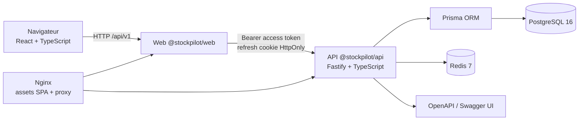
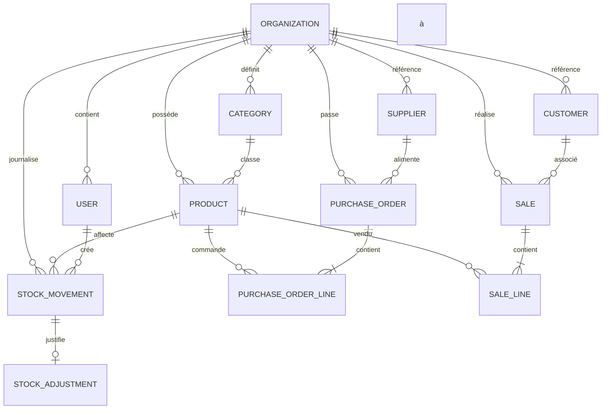

# Architecture de StockPilot

> Document de référence pour comprendre les choix de structure, les flux de données et les frontières de responsabilité. Le contrat HTTP détaillé se trouve dans [`API.md`](./API.md).

## 1. Vision et périmètre

StockPilot aide une petite entreprise à suivre ses stocks, ses approvisionnements et ses ventes. L'application doit rester simple à déployer pour un développeur ou une équipe, tout en conservant des frontières claires entre l'interface, l'API et les données.

Le premier périmètre couvre :

- une organisation (tenant) et plusieurs utilisateurs avec rôles ;
- un catalogue de produits et de catégories ;
- des mouvements de stock et des ajustements traçables ;
- des fournisseurs, des commandes d'achat et des clients/ventes ;
- un tableau de bord et des alertes de seuil ;
- une API REST versionnée, une interface web responsive et des exports CSV.

Les intégrations avec des ERP, des brokers, des prestataires de paiement et des fournisseurs de données de marché ne font pas partie du premier périmètre. Elles devront être ajoutées derrière des adaptateurs explicites.

## 2. Vue d'ensemble



### Exécution locale

- Vite sert `apps/web` sur `http://localhost:5173` avec rechargement à chaud.
- Fastify sert `apps/api` sur `http://localhost:3000`.
- Le navigateur appelle l'API via `VITE_API_URL` et transmet un access token en Bearer.
- PostgreSQL et Redis peuvent être lancés avec Docker Compose ou installés localement.

### Exécution Docker

- `web` est une image Nginx qui sert le bundle Vite et les fichiers statiques.
- Nginx proxifie `/api/` vers le service `api:3000`; le navigateur reste sur une seule origine.
- `api` applique les migrations Prisma au démarrage (désactivable avec `RUN_MIGRATIONS=false`), puis lance Fastify.
- `postgres` et `redis` conservent leurs données dans des volumes nommés.
- Les contrôles de santé et les conditions `depends_on` évitent de démarrer le web avant que l'API soit prête.

## 3. Responsabilités des composants

| Composant | Responsabilités | Ne doit pas faire |
| --- | --- | --- |
| `apps/web` | Navigation, formulaires, états de chargement/erreur, visualisation, appels HTTP via Axios/React Query | Contenir une règle de stock ou un secret JWT |
| `apps/api` | Authentification, autorisation, validation, orchestration métier, sérialisation, contrôle d'accès tenant | Exposer directement Prisma ou Redis au web |
| Prisma | Accès typé au schéma PostgreSQL, migrations et requêtes transactionnelles | Contenir les règles d'autorisation HTTP |
| PostgreSQL | Source de vérité des organisations, utilisateurs, catalogue, mouvements et documents | Servir de cache de session |
| Redis | Sessions de refresh révocables et état éphémère à durée de vie limitée | Détenir la source de vérité métier |
| Nginx (Docker) | Servir la SPA, router les chemins inconnus vers `index.html`, proxifier l'API | Implémenter les contrôles métier |

## 4. Organisation du monorepo

```text
StockPilot/
├── apps/
│   ├── api/       # @stockpilot/api — Fastify, Prisma, tests Vitest
│   └── web/       # @stockpilot/web — React, Vite, tests Vitest
├── infra/
│   ├── api.Dockerfile
│   ├── web.Dockerfile
│   ├── api-entrypoint.sh
│   └── nginx.conf
├── docs/
│   ├── API.md
│   ├── ARCHITECTURE.md
│   └── DECISIONS.md
├── docker-compose.yml
└── package.json
```

Les scripts racine ciblent les chemins `apps/api` et `apps/web` afin que le monorepo reste lisible même lorsque les manifests locaux sont renommés. Les contrats de package attendus sont `@stockpilot/api` et `@stockpilot/web`; toute évolution de nom doit être répercutée dans les workspaces, Docker et la CI.

### Frontend

Le frontend est un client HTTP et ne constitue pas une source de vérité. React Query gère le cache et l'invalidation après une mutation. Les formulaires sont validés côté UX, mais la validation définitive est effectuée par l'API avec des schémas de requêtes.

### API

L'API suit une organisation par module métier. Une route ne doit :

1. vérifier l'authentification et les rôles lorsque l'opération l'exige ;
2. valider les paramètres avec le schéma Zod du module ;
3. appliquer le filtre `organizationId` de l'utilisateur ;
4. exécuter la transaction métier ;
5. sérialiser les montants et dates dans un format stable ;
6. renvoyer l'enveloppe commune (`success`/`data` ou `success`/`error`).

## 5. Modèle métier

Le modèle complet est défini dans `apps/api/prisma/schema.prisma`. Les principaux agrégats sont :

- **Organization** : tenant, devise, fuseau horaire et propriétaire des données.
- **User** : identité, rôle (`ADMIN`, `MANAGER`, `EMPLOYEE`, `VIEWER`) et état actif.
- **Category** : hiérarchie optionnelle de catégories.
- **Product** : SKU, code-barres, unité, prix de coût, prix de vente, taxe et seuils.
- **Supplier / Customer** : coordonnées et historique de relation.
- **StockMovement** : journal immuable des entrées/sorties et de leur valorisation.
- **StockAdjustment** : correction métier associée à un mouvement et à un motif.
- **PurchaseOrder / PurchaseOrderLine** : commande fournisseur et réception partielle/totale.
- **Sale / SaleLine** : vente, coût de revient, marge et impact sur le stock.



### Invariants métier

1. **Isolation tenant** : toute ressource métier est filtrée par `organizationId`; un identifiant UUID connu ne suffit pas à contourner cette frontière.
2. **Stock dérivé** : le stock courant est la somme des mouvements signés. Il ne doit pas être modifié directement dans une table de produits.
3. **Traçabilité** : une entrée, une sortie ou un ajustement conserve son motif, sa référence et son auteur lorsqu'ils sont connus.
4. **Montants en décimaux** : les prix, taxes, totaux et quantités utilisent `Decimal` en base; ils sont convertis en nombre uniquement à la frontière HTTP.
5. **Commandes** : une réception d'achat et la mise à jour de la quantité reçue doivent être atomiques.
6. **Vente** : la vente, ses lignes, la marge et le mouvement de sortie doivent être enregistrés dans une transaction unique.
7. **Suppression logique** : produits, fournisseurs, clients et utilisateurs sont généralement désactivés afin de préserver l'historique.

## 6. Flux métier

### Entrée de stock

1. Un utilisateur autorisé crée une commande d'achat.
2. La commande passe à l'état approprié.
3. La réception valide les quantités et les coûts.
4. L'API crée un ou plusieurs `StockMovement` de type `PURCHASE_RECEIPT` dans une transaction.
5. Le tableau de bord recalcule les alertes à partir du stock courant.

### Ajustement

Un ajustement crée un mouvement (`ADJUSTMENT_IN` ou `ADJUSTMENT_OUT`) puis son `StockAdjustment` avec un motif contrôlé. Une correction ne doit pas être traitée comme une suppression silencieuse.

### Vente

La vente valide le stock disponible, fige les lignes et le coût de revient au moment de l'opération, calcule les taxes et la marge, puis génère le mouvement de sortie. Les montants sont conservés avec la précision métier en base.

## 7. Sécurité

- Les mots de passe sont hachés avec bcrypt; aucun mot de passe n'est stocké en clair.
- Un access token JWT de courte durée porte l'identifiant, l'organisation, l'email et le rôle.
- Le refresh token est aussi retourné par l'API pour les clients non navigateur, mais il est stocké dans un cookie `HttpOnly`, `SameSite=Lax`, limité au chemin `/api/v1/auth` pour le web.
- Les refresh tokens sont mémorisés dans Redis et renouvelés par rotation; l'ancien jeton est révoqué avant l'émission du nouveau.
- Redis n'est pas la source de vérité : perdre ses sessions force une nouvelle authentification, sans perdre les données PostgreSQL.
- Helmet, CORS explicite, limitation de débit et validation Zod sont appliqués au périmètre HTTP.
- Les secrets de production sont injectés par variables d'environnement ou par un gestionnaire de secrets; `.env` n'est jamais versionné.
- Les ressources de tenant sont filtrées côté service, pas seulement dans le contrôleur HTTP.
- Les journaux applicatifs ne doivent pas contenir de mot de passe, de token, de cookie ou de données de connexion.

Avant une mise en production, prévoir une rotation des secrets, TLS de bout en bout, une politique de sauvegarde PostgreSQL, une politique de rétention et un audit des accès administrateur.

## 8. Données et exploitation

- Les migrations Prisma sont la seule source de modification du schéma en environnement partagé.
- `migrate deploy` est non interactif et convient à Docker/CI; `migrate dev` est réservé au développement local.
- Les volumes `postgres_data` et `redis_data` sont persistants. `docker compose down -v` les supprime définitivement.
- Une sauvegarde PostgreSQL testée et une procédure de restauration doivent précéder toute production.
- Les ressources API doivent être observées avec des métriques de latence, taux d'erreur, saturation de la base et taux de refresh échoué.
- Les timestamps sont sérialisés en ISO 8601 UTC; la devise et le fuseau sont des attributs de l'organisation.

## 9. Mise à l'échelle et limites connues

La topologie actuelle convient à un développement, un portfolio ou une petite équipe. Elle ne constitue pas encore une plateforme multi-région. Les limitations connues sont documentées dans le README ; les extensions (file de travaux, cache distribué, sauvegarde managée, observabilité centralisée) doivent être décidées avant le passage à une forte charge.

## 10. Stratégie de vérification

La CI installe les workspaces, génère le client Prisma, applique les migrations sur PostgreSQL 16, puis exécute lint, typecheck, tests et build. Les tests d'intégration doivent utiliser un tenant isolé et ne doivent jamais écrire dans une base de production. Les captures et métriques de performance éventuelles doivent être datées et reproductibles.
